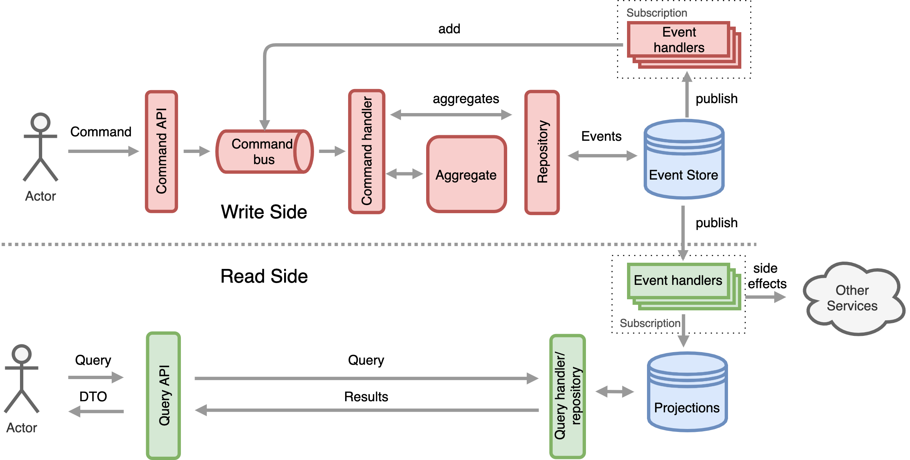

# CQRS, event-sourcing, DDD and hexagonal architecture: Tracking order service

The following repository tries to describe CQRS pattern by implementing it with Kotlin as a language and Ktor as a base
 framework.
 
**This is not production code, this is a CQRS implementation in order to understand the pattern.**

Also, I am not an expert on the topic, not even a beginner, so this is a way to learn.
 
 - [CQRS, event-sourcing, DDD and hexagonal architecture: Tracking order service](#cqrs--event-sourcing--ddd-and-hexagonal-architecture--tracking-order-service)
   * [CQRS overview](#cqrs-overview)
     + [App without CQRS](#app-without-cqrs)
     + [Simple CQRS](#simple-cqrs)
     + [CQRS with separate storage engines](#cqrs-with-separate-storage-engines)
       - [Dual writes](#dual-writes)
     + [CQRs with event sourcing](#cqrs-with-event-sourcing)
   * [Simple todo-list micro-service](#simple-todo-list-micro-service)
     + [Domain model with DDD](#domain-model-with-ddd)
     + [Event sourcing](#event-sourcing)
       - [Designing a simple event store](#designing-a-simple-event-store)
     + [Fitting command-side in hexagonal architecture](#fitting-command-side-in-hexagonal-architecture)
     + [Simple Query-side](#simple-query-side)
     + [Project structure](#project-structure)
   * [tech stack](#tech-stack)
   * [Running tests](#running-tests)
   * [Running the app](#running-the-app)
   * [Lessons learned](#lessons-learned)
   * [Related links](#related-links)
 
## CQRS overview

CQRS stands for Command Query Responsibility Segregation, and it is a pattern introduced by [Greg Young at 2010](https://cqrs.files.wordpress.com/2010/11/cqrs_documents.pdf),
 it is also an extension from an older concept, [CQS](https://en.wikipedia.org/wiki/Command%E2%80%93query_separation) introduce by by Bertrand Meyer.
 
Conceptually, CQRS is very simple, the basic idea is to separate the querying of data (read-side/query) from the
 updating of data models (write-side/commands).
 
But, let's see a more elaborate but brief explanation in the next sections ...
 
### App without CQRS

The typical approach of an application/micro-service without applying CQRS looks like this:

<p align="center">
  
</p>

There is one model, where the app performs writes and reads and we use the same classes for same use cases.

We can apply any architectural pattern like n-layered, hexagonal, onion or clean architectures on top of that but the
 main idea would remain the same.

### Simple CQRS

In it's simplest form CQRS only needs to segregate the responsibility between commands (write requests) and 
queries (read requests). The write requests and the read requests are handled by different objects.

<p align="center">
  
</p>

One write model, which you can use to change the state of your domain objects. Then multiple read models, one for
 each client. 
 
That way, there will be less coupling, so better Separation of Concerns and it will be easy to evolve the model in
 any direction. Business logic would belong to the write model and the read model would be more simple.
 
The problem here is that we are still sharing the database with both sides, so we could have scalability and
 performance, also patterns like micro-services are not fitting if we want to separate the projects in different
  services.

But let's evolve this to next step ...

### CQRS with separate storage engines

The next natural step is to separate the storage as well in two sides, the write side and the read side.

<p align="center">
  
</p>

The write side represents the state of the application and the read side are the projections (schemas optimized to
 simplify the read for a given consumer). We can even go one step further and have two different deployable applications.

Projection mechanisms are the tools/processes that get the changes from the write database, prepare and update the
 projections; They could be anything that works, from buses, event logs or just schedulers for query and update.  

The new advantages of this separation are:

- Scalability: we can scale independently both sides depending on the workload
- Performance: we can apply different tools and storage engines that fit better for each case.
- Query simplification. The read side can use a storage engine and schema that is optimized for queries.

But, sadly it also comes with drawbacks:

- Complexity: Now we have a more complex application design.
- Eventual consistency: Now the read side will be eventually consistent, so we will have to deal with distributed
 transactions. 
- Dual writes

#### Dual writes
 A dual write describes the situation when you change data in 2 different systems, for example inserting a record in
  a database and send a message to a queue in a local transaction; Imagine a situation like this:
```kotlin
transaction.begin() 
database.insert(record) 
queue.send(message)
transaction.commit() 
``` 
Now, this piece code is executed, but transaction commit fails, without an additional layer that ensures
 data consistency over both services, there is no way to rollback the message if it was already sent.
 
 In almost all the post that you can find over internet about CQRS, this problem is underestimated but it can lead you 
 to a very inconsistent state of your system. 

The way to solve/avoid dual writes is to split the communication into multiple steps and only write to one
 external system during each step, here some solutions:

- [Transactional outbox pattern](https://microservices.io/patterns/data/transactional-outbox.html): If you use a RDBMS
 you can create a separate table (out-box), where it will stored the changes to be done in other systems. Then, 
  when you have to do a dual write, you create a local transaction where you commit together the changes in
   your domain and the changes to be propagated in out-box table. After that you just need to fetch the events
    and propagate the changes. 
 *Note*: Your projection mechanism will have to handle idempotency and retry mechanisms because the propagation part can
  also fail and deliver messages more than once.
- Use [CDC](https://en.wikipedia.org/wiki/Change_data_capture) tools (change data capture), like Debezium, they will
 capture and propagate the changes ensuring consistency.
- Use an event-store in the write side, this will be explained in the following section.  

### CQRs with event sourcing

The last step is to introduce [event sourcing](https://microservices.io/patterns/data/event-sourcing.html), with this
 approach we would remove the dual write problem but we will introduce new advantages and drawbacks. The idea is the
  same as the previous approach but using an event store as a database.

<p align="center">
  
</p>

In a event store, instead of keeping the current state of the system updating it when we have a change like we would
 do in a relational database, we will represent entities as a sequential list of events, we will explain the topic
  later on in a dedicated section.

Till now, we have implemented CQRS in essence, but it is an already evolved pattern and also comes together with
 for other practices and patterns. Next diagram shows how a CQRS usually looks with :

<p align="center">
  
</p>

CQRS naturally fits with:
- DDD
- Command-bus
- Command-handlers
- Event-handlers
- Event-sourcing
- Optimistic locking

Any of these patterns are mandatory to apply CQRS, you don't have to use them, in fact in productions environments you
 should omit/change them if they are over-complicating your system.

Check [here](http://www.cqrs.nu/faq) to see a brief explanation of these patterns!  

## Simple todo-list micro-service

Having explained CQRS key concepts, let's think a problem to solve, where we can apply all it. 

Imagine that we are in a fake company, and of course we have an internal micro-service ecosystem growing up. 
We need to build a new feature for all the frontends ... Boom! a **TODO-LIST** to help the customers keeping track of
 their daily obligations.

So, our sample application is a super simple TODO-LIST micro-service, where:

MVP:
```
- A todo-list can be created 
- We can add a task to a todo list
- We can mark a task as done
- When all tasks on a todo-list are done, automatically, todo-list will be marked a as done as well 
```
Second iteration:
```
- Rename todo-lists
- Rename tasks
- Delete todo-lists
- Delete tasks
- Prioritise tasks
```

### Domain model with DDD

There is a perfect exercise that would fit for our goal, designing and modeling DDD and CQRS as a context, and it is
 called [event-storming](https://en.wikipedia.org/wiki/Event_storming), it is workshop that help us to identify our
  DDD components and dependencies. But our problem is simple, we are not going to explain it or even try to apply it
  , event-storming would deserve a whole blog.

So, I will try to apply DDD concepts right away, sorry if I make mistakes but I am not a expert.

Let's map out our business domain for the MVP:

- Aggregate Root: `TodoList`
- Entities: `Task`
- Value objects: `Status`, `TodoListId`, `TaskId`, `UserId` (user reference)
- Factories: `TodoList.Factory`
- Aggregate: All of them

DDD [definitions](https://dddcommunity.org/resources/ddd_terms/)

### Event sourcing

In a nutshell, event sourcing differs from a typical approach on how a business object is persisted, instead of
 storing the current state, it stores a sequence of state changing events.

This restriction has some implications in our design:

- Aggregates should generate events when it's state changes.
- Aggregates should be able to be reconstructed from an event stream.
- We will need a mechanism to store events, an event-store.
- Our repositories will just `get` and `save` aggregates, but under the hood they will handle streams of events.
- And more implications and complexities ... check [links section](#related-links) at the end, for more information
 about event sourcing.

Coming back to our new domain, a todo-list lifecycle could be modelled as the following sequence of events: 

- `TodoListCreated` 
- `TaskAdded`
- `TaskFinished`
- `TodoListFinished`

#### Designing a simple event store 

There are already event-store production ready implementations that would fit for our purpose, but we will try to
 design a simple event-store in order to understand event sourcing from the implementation side.
 
As we said, event-sourcing as an idea, is pretty simple:

> The core idea of event sourcing is that whenever we make a change to the state of a system, we record that state
> change as an event, and we can confidently rebuild the system state by reprocessing the events at any time in the future.
> Martin fowler

If we think out of the box and trying to DDD agnostic, we could think that an event store just as a database that
 allow us to:

- **Append events to a specific stream of events**
- **Retrieve all events from an specific stream**
- **Publish events that happened in the system**

We already know that event sourcing is more complex than that, a production-ready event store will provide features
 like:
- [Optimistic locking](https://enterprisecraftsmanship.com/posts/optimistic-locking-automatic-retry/) 
- [Rolling snapshots](https://eventstore.com/docs/event-sourcing-basics/rolling-snapshots/index.html)
- Reliable pub/sub 
- Distributed storage
- Event replaying
- Scalability
- Many others

But let's think in a minimal implementation that allow us to write and read per aggregate.
 
Event Store could be an *append-only storage mechanism*, where each entry could be as simple as:

```
 +----------+----------------+--------+--------+
 |stream_id |type            |payload |version |
 +----------+----------------+--------+--------+
 |4db3b6ae  |TodoListCreated |{json}  | 1      | 
 |202dba03  |TodoListCreated |{json}  | 1      |
 |202dba03  |TaskAdded       |{json}  | 2      |
 |202dba03  |TaskAdded       |{json}  | 3      |
 +--------+------------------+--------+--------+ 
```
With this simple definition in mind, we are be able to provide a simple database design for a CQRS environment
, allowing to read and write sequences of immutable events for a particular aggregate, in our case instances of todo-lists.

 We are also ready to implement an event store in almost any way, in memory, using a RDBMS, with a nosql database or
  just a file ... but in this project, for the sake of simplicity, a simple in-memory solution is the choice:
 - [Event store definition](/command-side/src/main/kotlin/com/alo/cqrs/todolist/infrastructure/cqrs/EventStore.kt)
 - [In memory implementation](/command-side/src/main/kotlin/com/alo/cqrs/todolist/infrastructure/cqrs/InMemoryEventStore.kt)
 
We could think in many more fields, like timestamp (when the event happened), eventId (to handle idempotency), 
transactionId (to group events), sequence number (for all events), clusterId (to group or subscribe streams in a more
 granular way) or a correlationId (allowing references to a particular transaction/request) but for our simple
  implementation we don't need them.

### Fitting command-side in hexagonal architecture

Till now we have CQRS, DDD and event-sourcing, but now we have to fit everything over an architectural pattern, and
 in our case it is hexagonal architecture, check this [other repo on my github](https://github.com/albertllousas/implementing-hexagonal-architecture) for a detailed explanation of the
  pattern.

Trying to fit all the components in an hexagonal architecture is not easy at all, but let's see how a general diagram
 of cqrs with hexagonal would look like:
 
<p align="center">
  
</p> 

And now let's focus in our problem:

<p align="center">
  
</p> 

Hexagonal architecture is all about ports and adapters, so one way to fit CQRS would be:

- Application services: Use cases of the app, in our case the **command handlers**, they would implement the inbound
 ports to the hexagon. 
- Domain: The hexagon itself, the business logic composed by the domain model (DDD patterns) and port interfaces.
- Infrastructure: The out-side world  
    - Adapters:
        - Inbound adapters: They call the entrypoints (inbound/driver ports) to the hexagon, in our case **HttpRoutes**  and  
        **EventHandlers**, they do it through the command bus.
        - Outbound adapters: They implement the outbound/driven ports and adapt/translate the outside world to our
         domain, mainly **aggregate repositories** implementations.
    - Non-hexagonal components: All the other components, **command-bus**, the **event-store** and any third party
     integration that the app would need. 
     
As we already said before, this is just an example on how to do it, use these patterns depending on your app
 requirements, for example command-handlers can be totally async or return values, or you can not use them at all.

### Simple Query-side

Hexagonal architecture is a domain-centric architectural pattern, but since query side does not have domain or any
 business logic, do we need an hexagonal approach? 

Query side, as CQRS trend advocates for, should be as thin as possible, getting close to the data store, skipping
 not necessary layers.

So, what are the responsibilities of the query side? 

1. Read [projections](http://cqrs.wikidot.com/doc:projection), using query handlers
2. Update [projections](http://cqrs.wikidot.com/doc:projection), using event handlers
 
If we think about it, there is no domain modeling or business involved here, it is just update and read views.

We have even omitted the repository pattern here.

Having said that, the query side should be as lean/thin as we can.

Since views/projections are isolated, meaning that they can be accessed and updated without any other dependency than
 the stream of event and the storage, a simple [package-by-feature](http://www.codingthearchitecture.com/2015/03/08/package_by_component_and_architecturally_aligned_testing.html) would be a good way to structure the project, 
 getting the benefits lower coupling and cohesion.
 
Architecturally, query-side would be:

<p align="center">
  
</p> 

### Project structure

The project code has been split in three different modules:

- [`command-side`](https://github.com/albertllousas/simple-cqrs-with-es/tree/master/command-side): All the write side
 code, as previously explained, follows the hexagonal architecture:

```kotlin
com.alo.cqrs.todolist
                `|-- application // command handlers,they implement the inbound ports
                 |-- domain 
                 |   |-- model // the heart of the hexagon
                 |   |   `-- todolist // todolist domain
                 |   `-- ports // boundaries of the hexagon
                 |       |-- inbound // inbound/left/driver boundary
                 |       `-- outbound // outbound/right/driven boundary  
                 `-- infrastructure // outside the hexagon
                     |-- adapters // translators between the domain and the infrastructure  
                     |   |-- inbound // they call the inbound ports, also call primary actors
                     |   |   |-- rest  // rest entry-points 
                     |   |   `-- eventhandlers // listeners of app events
                     |   `-- outbound // implementations of the outbound ports, repositories
                     `-- cqrs // non-hexagonal components

```

- [`query-side`](https://github.com/albertllousas/simple-cqrs-with-es/tree/master/query-side): read side code, simple
 architecture, following feature-by-package:

```kotlin
com.alo.cqrs.todolist.projection
                   `|-- EventConsumer.kt // subscriber to eventstore, dispatch changes to event-handlers
                    |-- Events.kt //all posible events
                    `-- todolistdetail // all components related to todolistdetail projection
                        |-- Dtos.kt // views
                        |-- EventHandlers.kt // view updaters (~~repositories)
                        |-- HttpRoutes.kt // view endpoints
                        `-- QueryHandlers.kt // view readers (~repositories)
```

- [`app`](https://github.com/albertllousas/simple-cqrs-with-es/tree/master/app): Wiring up, app runner and
 [acceptance tests](https://github.com/albertllousas/simple-cqrs-with-es/tree/master/app/src/test/kotlin/com/alo/cqrs/todolist/acceptance)

## tech stack

* Language: Kotlin
* JVM: 1.8.0*
* Web server: [Ktor](https://ktor.io/)
* Testing libraries/frameworks:
    * [JUnit 5](https://junit.org/junit5/docs/current/user-guide/)
    * [Assertj](https://joel-costigliola.github.io/assertj/)
    * [Mockk](https://mockk.io/)
    * [REST Assured](http://rest-assured.io/)

## Running tests
Project has been driven by tests and it is fully tested, run all with:
```shell
./gradlew test
```

## Running the app

Build the app:
```shell
./gradlew build
java -jar 
java -jar app/build/libs/app-all.jar
```
Send a create todo-list in the command side:
```shell
curl -X POST http://localhost:8080/todo-lists  \
  -H 'Content-Type: application/json' \
  -d '{"id": "77a9d273-441c-4ca6-a493-f617df6b5a23", "name": "my todo list"}'
```
Read the created projection in the read side:
```shell
curl http://localhost:8080/todo-lists/77a9d273-441c-4ca6-a493-f617df6b5a23/details 
{"id":"77a9d273-441c-4ca6-a493-f617df6b5a23","name":"my todo list","status":"TODO","tasks":[]}% 
```

## Lessons learned

CQRS is not easy at all, it is complex and takes time to understand all the patterns around.

Even though in this example I have tried to use all the "cool" patterns, you don't need them, the basics of CQRS are
 separate Commands from Queries, that's all.

You should use them only for parts of your ecosystem and only when you need highly concurrent systems with high
 performance/availability/scalability.
 
In a production environments, the best way to go would be to apply the patterns that you need, for example if you
 need to return values from commands, just do it, but first think why you are returning values, do you really need
  them, could you tackle the problem differently?

## Related links

- [CQRS](http://www.cqrs.nu/)
- [Greg Young original document](https://cqrs.files.wordpress.com/2010/11/cqrs_documents.pdf)
- [Udi Dahan - Clarified CQRS](http://udidahan.com/2009/12/09/clarified-cqrs/)
- [Greg Young m-r sample](https://github.com/gregoryyoung/m-r)
- [Martin Fowler about CQRS](https://martinfowler.com/bliki/CQRS.html)
- [Good article about when to use CQRS (pros & cons)](https://docs.microsoft.com/en-us/azure/architecture/patterns/cqrs)
- [Event Sourcing](https://microservices.io/patterns/data/event-sourcing.html)
- [Event Sourcing by Martin Fowler](https://martinfowler.com/eaaDev/EventSourcing.html)
- [Why event sourcing is awesome](https://dev.to/barryosull/event-sourcing-what-it-is-and-why-its-awesome)
- [Designing an event-store](https://itnext.io/implementing-event-store-in-c-8a27138cc90)
- [CQRS, things to consider](https://www.sderosiaux.com/articles/2019/08/29/cqrs-why-and-all-the-things-to-consider/)
- [DZone CQRS intro](https://dzone.com/articles/cqrs-and-event-sourcing-intro-for-developers)
